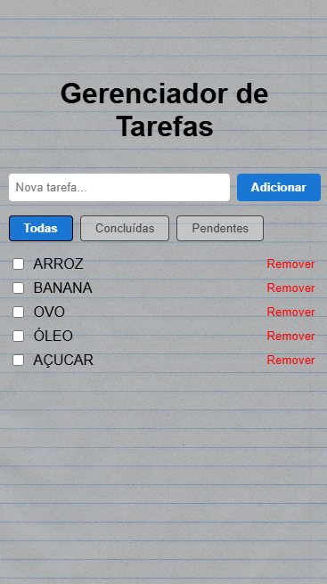

# Gerenciador de Tarefas

Uma aplicação avançada de lista de tarefas (Todo List) desenvolvida em React, focada em boas práticas, performance e experiência do usuário.

## 🚀 Motivação
Este projeto foi criado para demonstrar recursos modernos do React, como Context API, hooks customizados, memoização e persistência de dados, além de técnicas de organização de código e estilização responsiva.

## 📝 Funcionalidades
- Adicionar, remover e marcar tarefas como concluídas
- Filtrar tarefas (todas, concluídas, pendentes)
- Persistência automática das tarefas no localStorage
- Interface responsiva e visual moderno
- Efeito de folha de caderno como background
- Deploy automático no GitHub Pages

-
## 🛠️ Tecnologias e conceitos aplicados
- React 18
- Vite para build e desenvolvimento
- Context API para estado global
- Hooks customizados para reuso de lógica
- useReducer para controle de estado complexo
- useMemo e React.memo para performance
- useEffect para persistência no localStorage
- CSS responsivo e overlay customizado

## 💻 Como rodar o projeto
1. Clone o repositório:
	```bash
	git clone https://github.com/Ricardo-dev-00/Gerenciador_de_tarefas.git
	cd Gerenciador_de_tarefas
	```
2. Instale as dependências:
	```bash
	npm install
	```
3. Inicie o servidor de desenvolvimento:
	```bash
	npm run dev
	```
4. Acesse em [http://localhost:5173](http://localhost:5173)

## 📦 Estrutura de pastas
```
modulo-17/
├── package.json
├── vite.config.mjs
├── README.md
├── src/
│   ├── main.jsx
│   ├── App.jsx
│   ├── index.css
│   ├── assets/
│   │   └── img/
│   │       └── background.jpg
│   ├── components/
│   │   ├── TodoInput.jsx
│   │   ├── TodoList.jsx
│   │   └── TodoFilter.jsx
│   ├── context/
│   │   └── TodoContext.jsx
│   └── hooks/
│       └── useTodos.js
```

## 🖼️ Preview


## 📬 Contato
Desenvolvido por [Ricardo-dev-00](https://github.com/Ricardo-dev-00)

---
Feito para o curso EBAC | Módulo React Avançado

